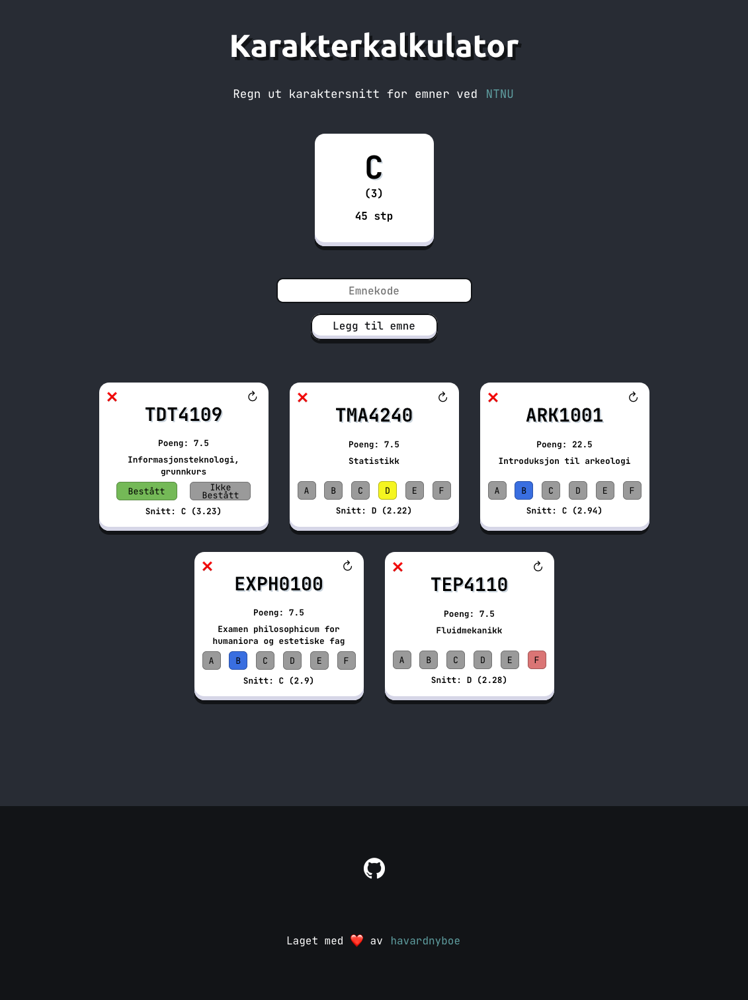

# karakterkalkulator

## Om karakterkalkulatoren

Finn emnene dine ved å søke etter emnekoden, tast inn karakteren du fikk i emnene og se det samlede snittet!

Nettsiden er laget med React, og bruker [grades.no](https://grades.no/about) API-et til å hente informasjon om emnene.

Slik kan nettsiden se ut når man har lagt til emner:

